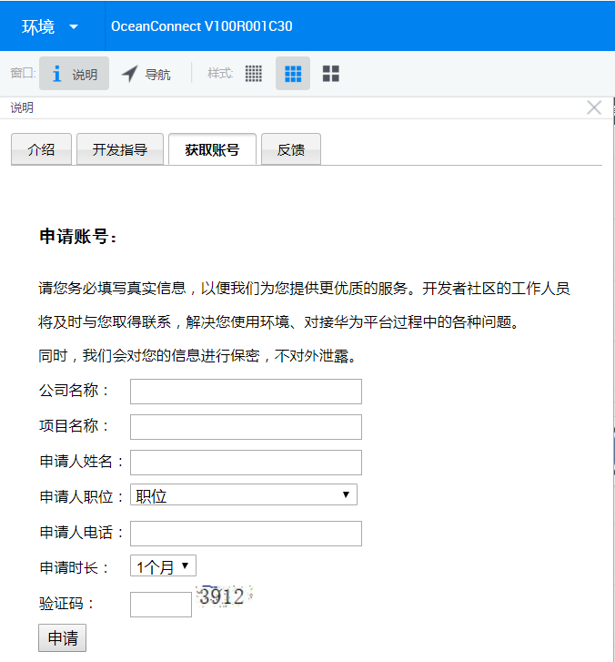

# 申请OceanConnect IoT平台账号

当前OceanConnect通过华为开发者社区面向个人开发者开放，可以访问[远程实验室](http://esdkremotelab.huawei.com/RM/Diagram/Index/9cec2dce-1f02-47d0-a67f-5d400f7c3d7b?diagramType=Topology)进行预约，在“IoT”环境目录下，选择“获取账号”即可。

申请账号成功后，您的邮箱将收到一封来自远程实验室的邮件，如下图：

1. App ID和密钥：在平台Portal中创建应用后的返回值。调用接口前，修改全局常量时会使用到。
2. 应用对接地址：远程实验室中OceanConnect平台的公网IP。
3. 应用对接端口：北向应用程序的对接端口。
4. 平台Portal：SP Portal界面的访问地址。
5. 登录账号/密码：登录SP Portal界面的账号/密码。
6. 其他信息项可以暂时忽略。

> 远程实验室环境仅用于开发者体验、调测。商用项目请申请[成为华为合作伙伴](https://marlite.force.com/)，并需要完成对接认证。

# OceanConnect IoT配套测试工具

| 软件名 | 描述 | 获取途径
| --- | --- | ---
| Profile文件Gateway : Gateway_Huawei_AR502CBGS-L.zip | 设备的描述文件，需要上传到OceanConnect | [下载](https://github.com/softbaddog/iot-codelabs/blob/master/1-nbiot-liteos-oceanconnect/tools/profile/LedAdvert_LiteOS01_MTRX01.zip)
| 北向应用Demo：North_App_demo | 扮演管理平台的角色，从OceanConnect获取设备上报的数据，并可以通过OceanConnect下发控制命令 | [下载](https://github.com/softbaddog/iot-codelabs/blob/master/1-nbiot-liteos-oceanconnect/tools/GUI%20demo/North_App_demo.rar)
| 编解码工具：codecDemo | 编解码工具源码与工程 | [下载](https://github.com/softbaddog/iot-codelabs/tree/master/1-nbiot-liteos-oceanconnect/tools/codecDemo)