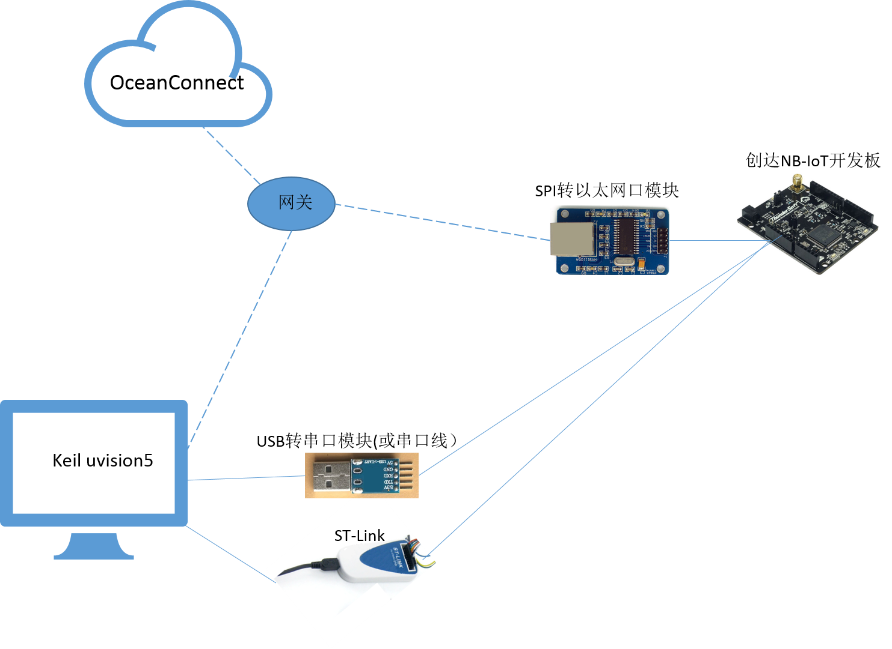
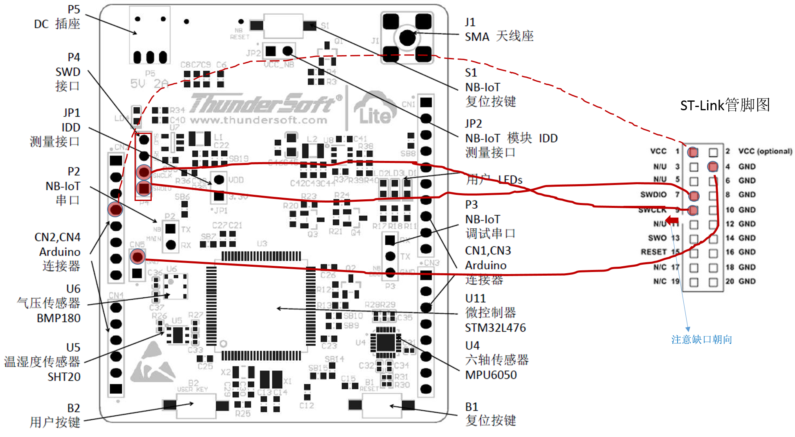
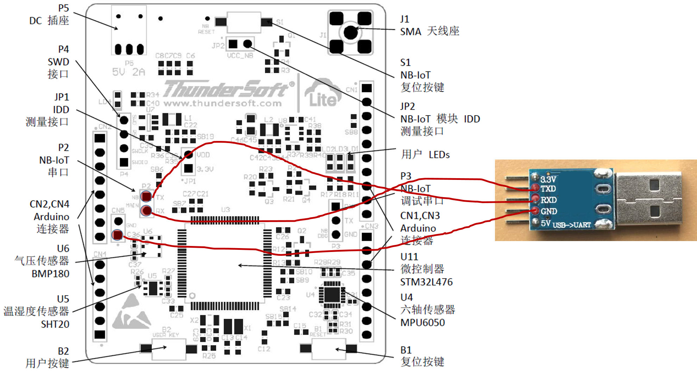
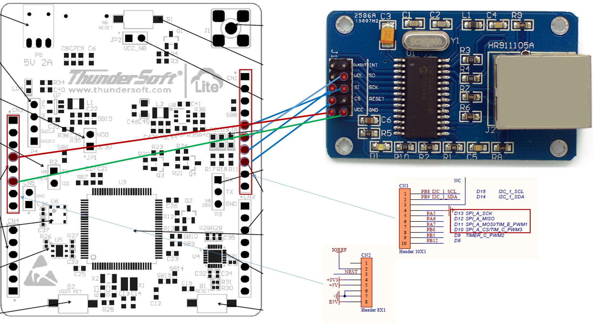

# 搭建NB-IoT开发环境

涉及到的设备、云服务、开发机组网图如下：

# 准备软件资源

软件名 | 描述 | 获取途径
--- | --- | ---
Keil uVision5 | 用于设备侧APP开发的IDE |  [ST官网下载](https://www.keil.com/download/product/)
STM32L4 Pack | Keil工具对于STM32L476的芯片支持包 | [ST官网下载](http://www.keil.com/dd2/Pack/)
ST-Link最新驱动 | 使用ST-Link烧写器下载程序到开发板时，需要预先安装此驱动 | 网上自行下载
串口工具 | 使用串口工具对开发板上NB-IoT模块进行配置 | 网上自行下载
LiteOS NB-IoT Demo工程：LiteOS_ThunderSoft_STM32FL476VETx | 设备侧APP示例，完成传感数据收集、上报，接受云平台控制 | [下载](https://github.com/softbaddog/iot-codelabs/tree/master/1-nbiot-liteos-oceanconnect/sample/LiteOS_ThunderSoft_STM32FL476VETx)
Profile文件Demo：LedAdvert_LiteOS01_MTRX01.zip | 设备的描述文件，需要上传到OceanConnect | [下载](https://github.com/softbaddog/iot-codelabs/tree/master/1-nbiot-liteos-oceanconnect/tools)
编解码插件Demo：package.zip | 需要上传到OceanConnect，对设备发送到OceanConnect的数据包进行解析 | [下载](https://github.com/softbaddog/iot-codelabs/tree/master/1-nbiot-liteos-oceanconnect/tools)
北向应用Demo：North_App_demo | 扮演管理平台的角色，从OceanConnect获取设备上报的数据，并可以通过OceanConnect下发控制命令 | [下载](https://github.com/softbaddog/iot-codelabs/tree/master/1-nbiot-liteos-oceanconnect/tools)
文件签名工具：signtool | 上传OceanConnect的profile和编解码插件，均需要使用此工具进行安全签名 | [下载](https://github.com/softbaddog/iot-codelabs/tree/master/1-nbiot-liteos-oceanconnect/tools)

# 申请OceanConnect平台账号

当前OceanConnect通过华为开发者社区面向个人开发者开放，可以访问[远程实验室](http://developer.huawei.com/ict/cn/doc/IoT-Platform-North-HelloWorld/index.html/zh-cn_topic_0065858910)进行预约，在“IoT”环境目录下，选择“OceanConnect V100R001C30”即可。

预约远程实验室成功后，您的邮箱将收到一封来自远程实验室的邮件，如下图：

1. App ID和密钥：在平台Portal中创建应用后的返回值。调用接口前，修改全局常量时会使用到。
2. 应用对接地址：远程实验室中OceanConnect平台的公网IP。
3. 应用对接端口：北向应用程序的对接端口。
4. 平台Portal：SP Portal界面的访问地址。
5. 登录账号/密码：登录SP Portal界面的账号/密码。
6. 其他信息项可以暂时忽略。

> 以上信息以实际邮件提供的内容为准。

> 远程实验室环境仅用于开发者体验、调测。商用项目请申请[成为华为合作伙伴](http://developer.huawei.com/ict/cn/site-iot/article/end-to-end)，并需要完成对接认证。

# 搭建步骤

## NB-IoT开发板使用前须知

- 注意NB模块的名称，BC95-B8和BD95-B5分别对应900MHz（移动，联调）与850MHz（电信）频段，如使用NB网络需插入对应运营商的SIM 卡。
- 检查开发板的跳线帽，JP1（Vcc 3.3V）和JP2（Vcc NB）应该是闭合的。
- 了解开发板硬件管脚，后面多处会用到。

## PC环境准备

1. 在PC上安装Keil uVision5，并导入STMicroelectronics STM32L4 Pack（略，具体步骤网上可以搜到）。
2. 在PC上安装ST-Link驱动（略，具体步骤网上可以搜到）。
3. 使用Keil将下载好的iteOS NB-IoT Demo工程打开，双击LiteOS_ThunderSoft_STM32FL476VETx\projects\STM32L476VE_THUNDERSOFT\HuaweiLiteOS.uvprojx。
4. 编译工程，默认代码可以正常编过。

## ST-Link烧写器连接NB-IoT开发板

我们将使用ST-Link连接NB-IoT开发板的SWD接口：

1. PC机通过USB线连接ST-Link烧写器。
2. ST-Link通过SWD模式连接NB-IoT开发板。
3. 在Keil工程选项中，打开Debug页签，选择调试通道为"ST-Link Debugger"。
4. 对工程Debug或Load，可以将代码通过烧写器加载到开发板运行。

> 对于个别烧写器，可能存在连接不稳定的情况，表现为Debug页签中机率性找不到设备，此时可以将ST-Link的VCC管脚接开发板上3.3V试试。

具体连线方式见下图。

## 若使用NB-IoT网络，串口连接NB-IoT模块

PC通过串口连接NB-IoT模块的步骤如下：

1. PC机安装串口调试软件，如ComHub（此类工具非常多，且使用简单，这里略过）,设置选项“波特率”为9600，“停止位”为1，“数据位”为8，“奇偶校验”为无。
2. 将PC机串口与开发板上NB-IoT模块引出的串口引脚连接，这里我们以常见的USB串口模块为例，具体连线方式见下图。
3. 在开发板上电的情况下，按下板载NB-IoT复位按键，重新启动NB-IoT模块，正式启动后，会在串口调试软件内看到“Neul OK”的打印。

## 若使用以太网络，网口模块连接开发板SPI接口

对于部分用户，可能本地运营商尚未开通NB-IoT网络，则需要使用SPI外接以太网口模块进行通讯，接线方式如下图所示：

至此，涉及到的软硬件环境已经准备好了，接下来进入各环节的开发阶段，整体跑通一遍业务，达到快速入门的目的。
