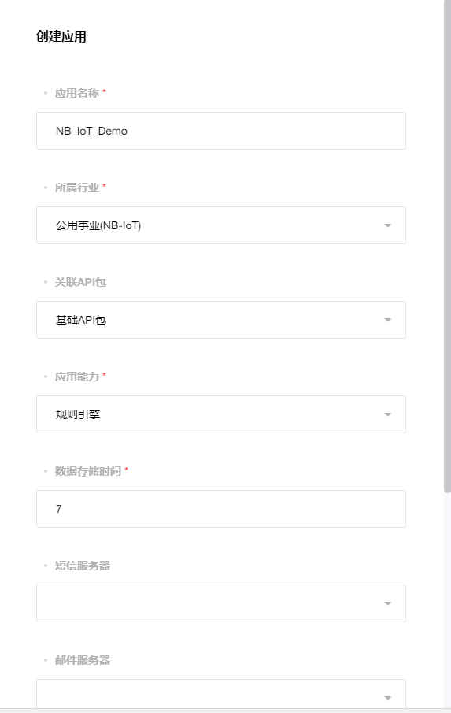
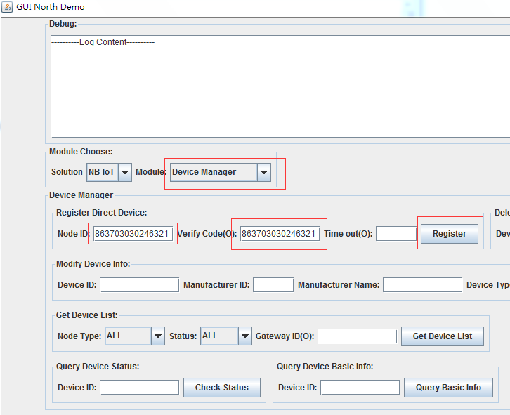
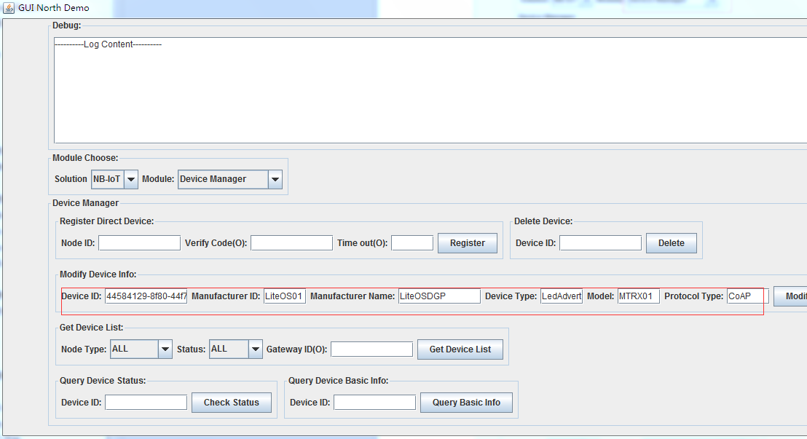

# 使用OceanConnect对接南向设备

整个端云方案由3个大的部分组成：南向设备、北向应用、设备profile和编解码插件。整体流程如下：

1. 首先开发者在IoT平台WebPortal上创建一个应用。
2. 上传Profile和编解码插件。
3. 北向应用在IoT平台上注册一个离线设备。
4. 然后南向设备通过NB芯片或者AgentTiny与IoT平台上的离线设备进行绑定。绑定成功之后，南向设备就可以发送采集的数据给IoT平台。
5. 南向设备采集到数据后，可以通过两种方式传输到Huawei IoT平台： AgentTiny方式或者NB芯片方式，此步骤已经在上一节中做过介绍，不再重复。

接下来，数据到达云平台之后，通过编解码插件转换成IoT平台识别的数据然后透传给服务器存储管理；同时. 北向应用通过下发命令给IoT平台，并并经由IoT平台下发到南向设备。

## 在OceanConnect平台上创建应用

- 使用OceanConnect申请到的账号，访问其提供的平台Portal地址。

- 创建应用，名称为“NB_IoT_Demo”，所属行业修改为“公共事业（NB-IoT）”。

- 创建成功后，会显示APP ID、密钥、北向应用对接地址、南向设备对接地址，这几项内容后面会用到，需要拷贝记录下来。

 

至此，应用创建完成。

## 上传Profile和编解码插件

接下来我们需要上传profile和编解码插件（这里我们直接拿做好的内容进行演示）。

- 在平台Portal页面左边找到设备管理->模型->导入模型。然后在页面右上角有个上传的按钮，如下图所示。

- 将制作好的profile文件上传，示例profile可以从这里[下载](https://github.com/softbaddog/iot-codelabs/tree/master/1-nbiot-liteos-oceanconnect/tools/LedAdvert_LiteOS01_MTRX01.zip)。
- 将制作好的编解码插件进行签名，下载[编解码插件](https://github.com/softbaddog/iot-codelabs/tree/master/1-nbiot-liteos-oceanconnect/tools/package.zip)和[签名工具](https://github.com/softbaddog/iot-codelabs/tree/master/1-nbiot-liteos-oceanconnect/tools/signtool)，然后将文件发送至iotadmin@huawei.com，由华为IoT平台管理员代为上传。

**签名过程如下：**

1. 打开签名工具，生成数字签名公私钥对。选择算法为“RSA2048+SHA256”，输入私钥加密口令并单击“生成公私钥对”按钮。
2. 保存生成的公私钥文件public.pem、private.pem，备用。
3. 对软件包数字签名。单击“导入私钥文件”将private.pem导入并输入私钥加密口令，单击“需要数字签名的软件包”导入待签名软件，单击“进行数字签名”完成签名。

> 软件包签名验证：单击“导入公钥文件”将public.pem导入，导入“需要验签的软件包”，单击“进行软件包验签”确认是否可以通过。如验证失败说明上面步骤有误，需要再仔细操作一遍。

**注意** 

> *公钥由华为平台统一管理，私钥由厂商按照自身安全机制保存管理。并且为了增强厂商保存私钥的安全性，在生成私钥过程中，工具强制要求输入口令加密私钥,一旦遗失或者泄露加密口令或私钥，将没有任何办法完成升级包签名机制，由此造成的安全问题由厂商自行负责。*

## 使用北向APP注册设备

北向应用demo程序是IoT平台提供的一个demo程序，用来给用户参考实现自己的定制化APP的。通过该demo程序用户可以了解如何进行设备注册，设备更新，查询数据，下发命令等IoT平台提供的基础能力。注册设备的步骤如下：

1. 打开北向应用APP。
2. 输入平台ip、端口、app id、password，先前我们从OceanConnect申请账号时，已经获取到IP和端口，ID和密码是我们在平台Portal上创建应用成功后取得的。

	
3. 登录成功后，进入Device Manager界面，输入node id和verify code进行注册。
	
4. node id和verify code取值相同，来自南向设备源码中ocean_sample.c中的设备名，定义在全局变量g_devsn中，两者保持一致即可。
	
5. 注册成功后，在北向APP内会显示返回的Device ID，需要记录下来以便后续根据此ID查询、修改设备配置信息。
6. 配置设备信息，在Device Manager功能输入厂商名、厂商ID等信息，这些都定义在上一节的profile文件中（devicetype部分）。
	
6. 此时，我们登录平台Portal，能够看到此Device ID的设备已经成功注册，但是状态是离线的。
	

## 南向设备运行并上报数据

1. 在PC上，用Keil将准备好的南向设备工程通过ST-Link加载到NB开发板上。
2. 开发板运行后，通过北向APP查询Device ID对应的设备信息，能够看到南向设备状态变更为"ONLINE"，此时在平台Portal界面上也能看到。
	
3. 进一步使用北向APP查询设备上报的信息，首先在Module 处选择Data Manager，然后输入Device id，再单击Get Service。
	
4. 获取到Service后，选择如下图中的内容进行数据查询，可以看到南向设备上报LedChar的数据为20。
	

## 向南向设备下发控制命令

除了能够查询数据，北向应用还可以给设备下发命令（如果设备profile中编写了命令相关的内容，这里我们提供制作好的profile，可以模拟设置南向设备LED的亮度）。命令下发在Command Manager下，如下图所示：

> 注：Expire time是命令能够在云平台上保存的时间，单位为秒，超时后命令会被清除。

下发命令成功后，再次通过Data Manager查询，发现上报的数据发生相应的改变，到此南向设备到OceanConnect上报数据、下发命令已全程打通，贡献你顺利通关。
