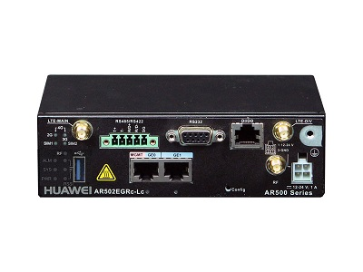

# 项目背景
	
EC-IoT是基于边缘计算构建的物联网解决方案，基于边缘计算网关开放的容器/VM（虚拟机）等平台，客户基于基础服务API开发自定义APP，并实现在边缘计算网关内的灵活部署，就近提供智能联接和数据处理业务。

我们将通过Step by Step的方式，指导开发者基于华为AR502CGS-L边缘计算网关，集成AgentLite组件快速连接到OceanConnect IoT平台，实现一个简易的“非直连传感器数据上报”和“命令下发控制”的Demo，应用开发者可基于此样例扩展自己的物联网应用。

# 你将学到什么

- 学会使用AR500系列边缘计算网关获取通过485串口连接的温湿度传感器数据
- 在LTE/以太网下，学会调用AgentLite API实现网关与非直连设备注册到OceanConnect IoT平台
- 最后学会使用OceanConnect IoT平台北向应用查看上报数据，以及对网关下的设备进行远程控制

# 你将需要什么

- 一台带容器功能的AR500系列网关
- 一根RS232串口线，网线若干（使用以太网）
- 4G SIM卡（使用LTE网络）
- Docker运行环境（可在Windows中创建Ubuntu虚拟机）
- 获取样例代码（[下载](https://github.com/softbaddog/iot-codelabs/tree/master/2-eciot-agentlite-oceanconnect/miniprojects)）