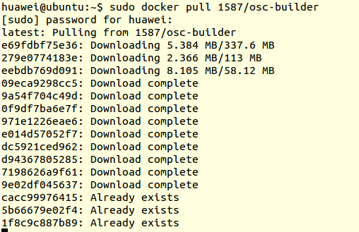
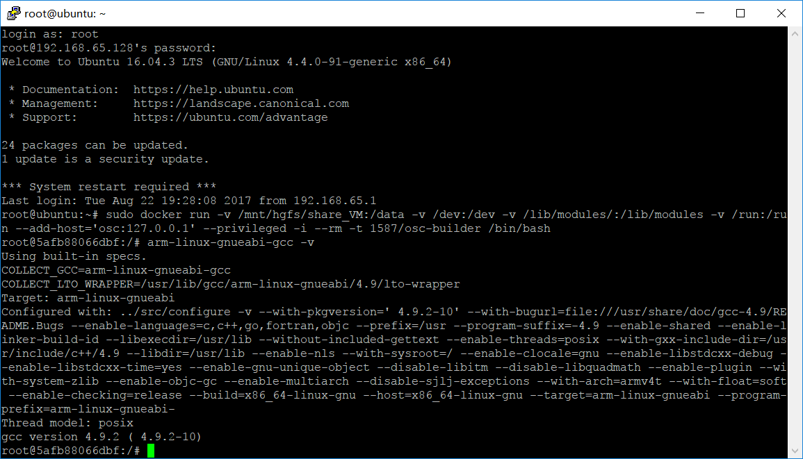
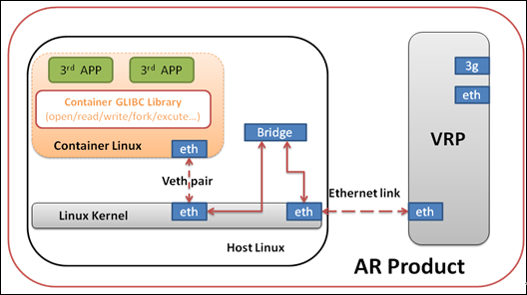
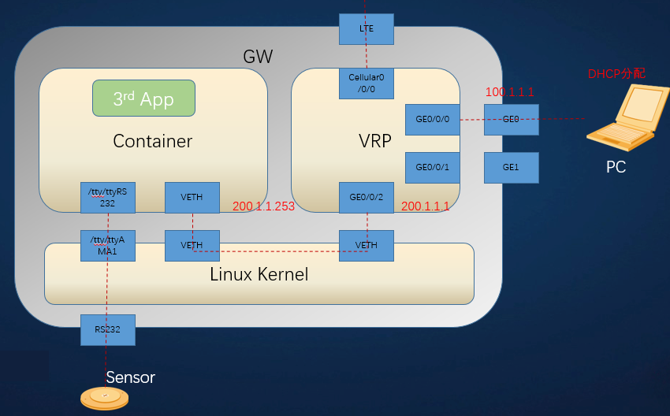
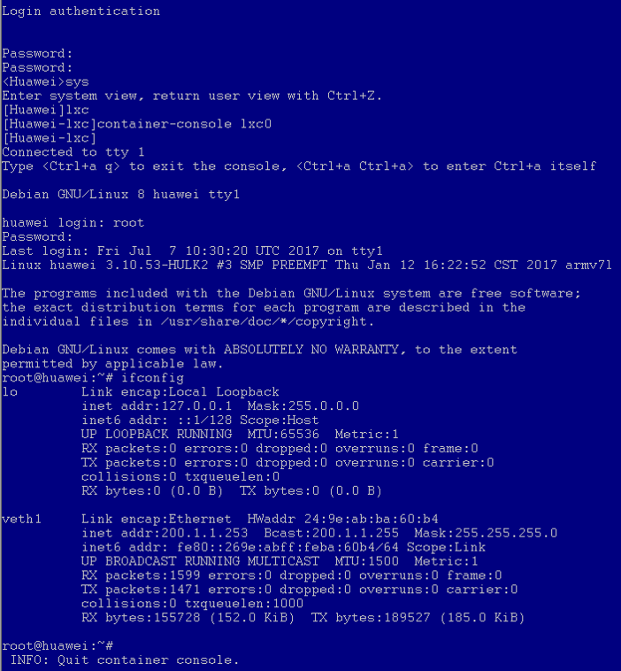
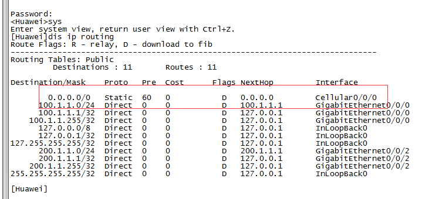
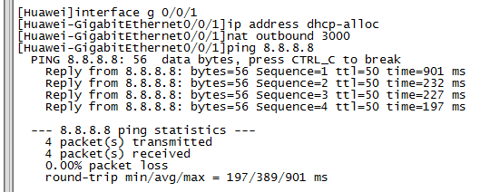
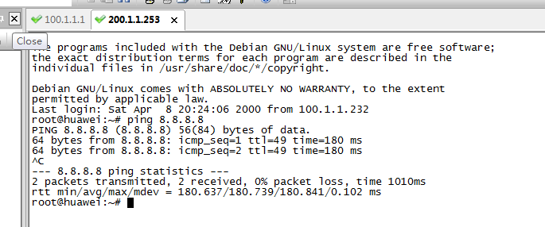

# 搭建网关容器应用开发环境

AR500网关内部容器系统选用Jessie Debian Linux, 源于标准Debian。开发者可选集成python、java vm运行环境，也可直接使用容器对应的工具链，开发部署自己的应用。


# 开发环境

由于边缘计算网关是基于ARM

1. 安装Ubuntu14.04以上版本
2. 安装并启动docker工具，从Internet上拉取镜像
```
sudo docker pull 1587/osc-builder
```


3. 在Docker中访问Ubuntu用户的资源（注意挂载的目录是容器外Ubuntu目录，存放实际代码位置）

```
sudo docker run -v /mnt/hgfs/share_VM:/data -v /dev:/dev -v /lib/modules/:/lib/modules -v /run:/run --add-host='osc:127.0.0.1' --privileged -i --rm -t 1587/osc-builder /bin/bash
```


如上图所示，就说明开发环境已经部署成功

# 内部网络



开发者将开发的应用部署在网关内部的容器内部，通过容器内部的eth口访问外部网络。



### telnet登录容器

1. PC连接通过GE0，通过telnet接入网关，telnet地址为100.1.1.1
2. 登陆VRP，登陆密码Admin@huawei
3. 进入lxc视图，通过重定向命令container-console lxc0重定向到容器
4. 登陆容器，用户名/密码均为root
5. Ctrl+a q退出重定向



> 可以观察到容器内Linux IP地址为200.1.1.253，可以使用ssh登录，用户名/密码均为root

# 配置网络

执行SYS，切换视图，然后查看当前的默认路由：

	dis ip routing



### 切换有线网络

默认是使用Celluar接口获取IP地址，如果希望切换到以太网方式，先执行

```
undo ip route-static 0.0.0.0 0.0.0.0 Cellular0/0/0
```

进入网口EG1，开启dhcp，设置NAT

```
interface g 0/0/1
ip address dhcp-alloc
nat outbound 3000
```



可以使用ping命令检查网络是否联通

登录虚机，检查网络



### 恢复部署LTE网络

重启设备（只要不执行save命令，重启都会恢复之前的配置）或添加默认路由即可
```
ip route-static 0.0.0.0 0.0.0.0 Cellular0/0/0
```