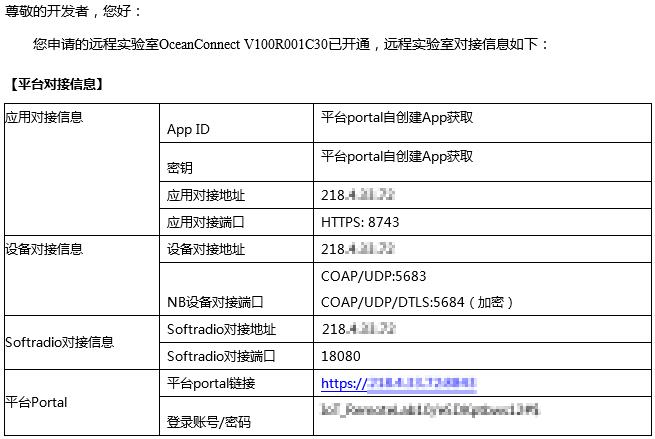

# 搭建网关容器应用开发环境

在开始工作前，我们需要准备好必备的硬件、软件资源，并搭建环境。

# 准备软件资源

软件名 | 描述 | 获取途径
--- | --- | ---
Profile文件Gateway : Gateway_Huawei_AR502CBGS-L.zip | 设备的描述文件，需要上传到OceanConnect | [下载](https://github.com/softbaddog/iot-codelabs/blob/master/2-eciot-agentlite-oceanconnect/tools/profile/Gateway_Huawei_AR502CBGS-L.zip)
Profile文件Demo：LedAdvert_Huawei_MTRX01.zip | 设备的描述文件，需要上传到OceanConnect | [下载](https://github.com/softbaddog/iot-codelabs/blob/master/2-eciot-agentlite-oceanconnect/tools/profile/LedAdvert_Huawei_MTRX01.zip)
北向应用Demo：North_App_demo | 扮演管理平台的角色，从OceanConnect获取设备上报的数据，并可以通过OceanConnect下发控制命令 | [下载](https://github.com/softbaddog/iot-codelabs/blob/master/2-eciot-agentlite-oceanconnect/tools/GUI%20demo/North_App_demo.rar)

# 申请OceanConnect平台账号

当前OceanConnect通过华为开发者社区面向个人开发者开放，可以访问[远程实验室](http://developer.huawei.com/ict/cn/doc/IoT-Platform-North-HelloWorld/index.html/zh-cn_topic_0065858910)进行预约，在“IoT”环境目录下，选择“OceanConnect V100R001C30”即可。


预约远程实验室成功后，您的邮箱将收到一封来自远程实验室的邮件，如下图：



1. App ID和密钥：在平台Portal中创建应用后的返回值。调用接口前，修改全局常量时会使用到。
2. 应用对接地址：远程实验室中OceanConnect平台的公网IP。
3. 应用对接端口：北向应用程序的对接端口。
4. 平台Portal：SP Portal界面的访问地址。
5. 登录账号/密码：登录SP Portal界面的账号/密码。
6. 其他信息项可以暂时忽略。

> 以上信息以实际邮件提供的内容为准。

> 远程实验室环境仅用于开发者体验、调测。商用项目请申请[成为华为合作伙伴](http://developer.huawei.com/ict/cn/site-iot/article/end-to-end)，并需要完成对接认证。

# 搭建步骤

## 容器运行环境

AR网关设备内部容器系统选用Jessie Debian linux, 源于标准Debian。当前AR5XX款型选用架构为armel(不支持硬浮点)。

在容器内部包含systemd系统服务管理软件、coreutil、apt-get deb包管理工具、rsyslog日志服务、Cron服务、dhcp client、ssh service等一些基础工具，详细信息可以在容器内通过dpkg –l命令查看提供了哪些软件包。

对于开发者，可选集成python、java vm运行环境，开发者在容器启动完成后通过apt-get命令从debian社区进行下载，自行完成应用安装.

容器内部默认包含有veth0网络口，用于经过VRP路由连接到外部网络，veth0网络IP地址默认由VRP经过分配，当前固定分配地址为100.1.1.1，客户可以连接设备物理eth口通过SSH登录到容器内.

> 默认用户名与密码都为root。

## 组网需求

AR路由器提供VRP平台及LXC系统服务；完成linux容器系统安装后，配置设备为linux容器系统分配IP地址；PC作为私网网络用户，能够通过设备与linux容器系统通信，同时linux容器系统能够通过设备上行4G/LTE业务接入internet；


首先需要用telnet方式登录设备，密码默认为：Admin@huawei.com

执行SYS，切换视图，然后查看当前的默认路由：

	dis ip routing


### 切换有线网络

默认是使用Celluar接口获取IP地址，如果希望切换到以太网方式，先执行

```
undo ip route-static 0.0.0.0 0.0.0.0 Cellular0/0/0
```
进入网口EG1，开启dhcp，设置NAT

```
interface g 0/0/1
ip address dhcp-alloc
nat outbound 3000
```


可以使用ping命令检查网络是否联通

登录虚机，检查网络


### 恢复部署LTE网络

重启设备（只要不执行save命令，重启都会恢复之前的配置）或添加默认路由即可

	ip route-static 0.0.0.0 0.0.0.0 Cellular0/0/0`


## 交叉编译环境准备

由于边缘计算网关是基于ARM

1. 安装Ubuntu
2. 安装并启动Docker
	sudo docker pull 1587/osc-builder`
3. 在Docker中访问Ubuntu用户的资源（注意挂载的目录是容器外Ubuntu目录，存放实际代码位置）

```
sudo docker run -v /mnt/hgfs/share_VM:/data -v /dev:/dev -v /lib/modules/:/lib/modules -v /run:/run --add-host='osc:127.0.0.1' --privileged -i --rm -t 1587/osc-builder /bin/bash
```